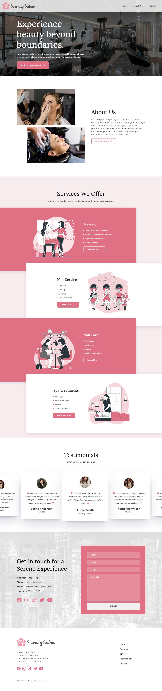

# Note

Boilerplate using Parcel + PugJS + SASS + Typescript. NodeJS must be latest version in order to work.

## To Start:
```yarn```
or 
```npm install```

## To Run:
```yarn dev```

## Link:
https://ellyx81.github.io/projects/serenity-salon/


# Screenshot


